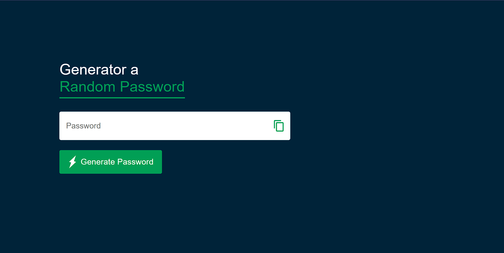
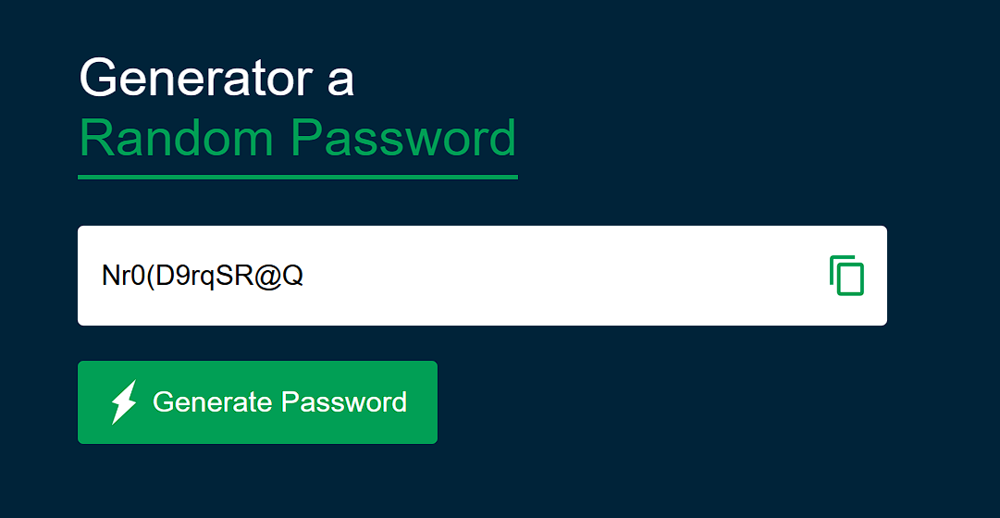

# Random Password Generator 🔐

A simple and secure Random Password Generator built with HTML, CSS, and JavaScript. This tool generates strong passwords to enhance your online security.

## Features 🌟

- Generates a random password with a default length of 12 characters.
- Includes uppercase letters, lowercase letters, numbers, and symbols for enhanced strength.
- Easy-to-use "Copy" feature for quick password retrieval.
- Responsive and clean UI design.


## Installation Steps 🛠️

1. Clone the repository:

2. Open the `index.html` file in your browser:
   ```bash
   open index.html
   ```

## How to Use 🎮

1. Click on the **Generate Password** button to create a random password.
2. Copy the generated password by clicking the **Copy** icon next to the password box.
3. Paste the copied password into your desired location.

## Technology Stack 🛠️

- HTML5
- CSS3
- JavaScript (ES6+)

## Code Highlights ✨

### Password Generation Logic:
```javascript
function createPassword() {
    let password = "";
    password += upperCase[Math.floor(Math.random() * upperCase.length)];
    password += lowerCase[Math.floor(Math.random() * lowerCase.length)];
    password += number[Math.floor(Math.random() * number.length)];
    password += symbol[Math.floor(Math.random() * symbol.length)];
    while (lenght > password.length) {
        password += allChar[Math.floor(Math.random() * allChar.length)];
    }
    passwordBox.value = password;
}
```

### Copy Functionality:
```javascript
function copy() {
    passwordBox.select();
    document.execCommand("copy");
}
```

## Screenshots 🖼️

### Main Interface:


### Password Generated:


## Future Enhancements 🚀

- Allow users to customize password length.
- Enable toggles to include/exclude specific character types (e.g., symbols or numbers).
- Add dark/light theme support for better accessibility.

## Acknowledgments 🙏

- Icon assets by [Flaticon](https://www.flaticon.com/).
- Design inspiration from various password management tools.

## License 🔒

This project is licensed under the MIT License.

---

I’m a beginner coder on a mission to create and learn. Your feedback means a lot!  
Contact me at: [derkaran@gmail.com](mailto:derkaran@gmail.com)  
Connect with me on LinkedIn: [](https://www.linkedin.com/in/karan-der/)

--- 
